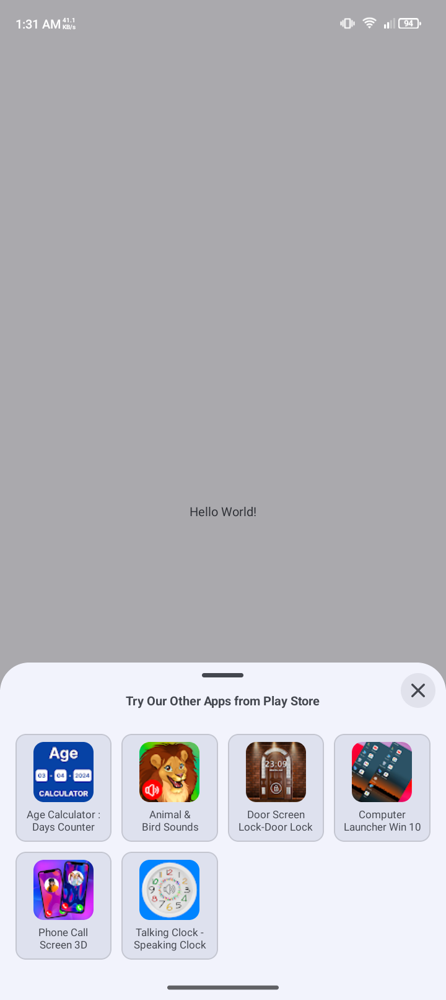
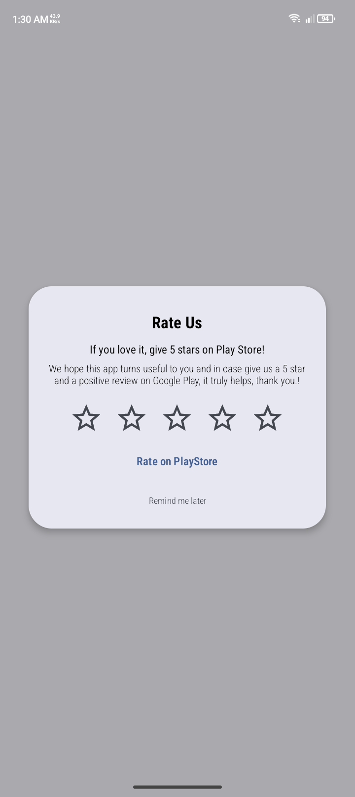
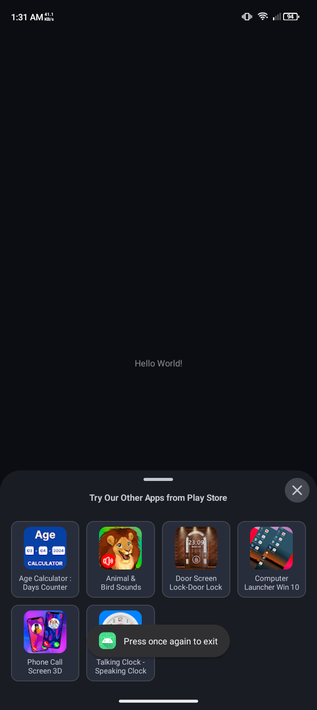
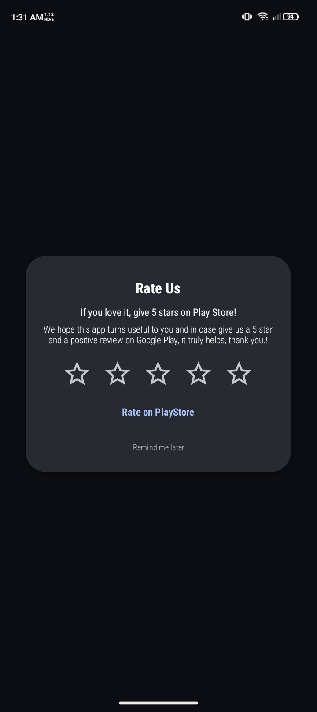

# 📌 PlayStoreMain   – PlayStore Helper

A powerful and easy-to-use Android library to handle **PlayStore** with clean APIs and modern Material dialogs.

---

## ✨ Features

### ⚙️ PlayStoreMain with Day Night
- Rate us Dialog
- Try our Apps Bottomsheet
- In App Update


---

## 🚀 Installation

### LATEST-VERSION
[](https://jitpack.io/#ruhsoft-jakir/PlayStoreMain)


Add it in your `settings.gradle` at the end of repositories:
```gradle
//dependencyResolutionManagement {
//    repositoriesMode.set(RepositoriesMode.FAIL_ON_PROJECT_REPOS)
//    repositories {
//        google()
//        mavenCentral()
        maven { url 'https://jitpack.io' }
//    }
//}

```
Add on dependency via **Gradle**  `build.gradle`  (jitpack.io support):

```gradle
dependencies {
	        implementation 'com.github.ruhsoft-jakir:PlayStoreMain:Tag'
}
```
#### LATEST-VERSION
[](https://jitpack.io/#ruhsoft-jakir/PlayStoreMain)


*(If not published yet, you can import `.aar` / `.module` locally.)*

---

## 🛠 Usage

### ⚙️ PlayStoreMain

Setup JAVA :
 ```java
public class DoRemoteJob {
    Context context;

    public DoRemoteJob(Context context) {
        this.context = context;

        PlayStore_updateFromPlayStore(context);
        PlayStore_tryOurOtherAppsLoad(context);
        PlayStore_RateUs(context);
    }

    private void PlayStore_updateFromPlayStore(Context context) {
        new PlayStore_Update(context);
    }

    private void PlayStore_tryOurOtherAppsLoad(Context context) {
        String developerName = context.getString(R.string.developerName);
        new PlayStore_TryOurApps(context, developerName, 2);
    }

    private void PlayStore_RateUs(Context context) {
        new PlayStore_RateUs(context, 2);
    }
}
```


if want to show rate dialog directly:
```java
 new Rate_Dialog_Material().showRateDialog(context);

```


## 🎨 UI/UX

- Material Design dialogs
 
---

## 🎥 Demo

Here’s how it looks in action 👇


| Day Try Our Apps                      | Day Rate Us                                  | Night Try Our Apps                                |Night Rate Us                               |
|---------------------------------------|----------------------------------------------|-------------------------------------|-------------------------------------|
|  |  |  | |


## 📲 Download Sample


## 🤝 Contributing

Pull requests are welcome! If you find any bug , open an issue or create a PR.

---

## 📜 License

This library is released under the **MIT License**.  
